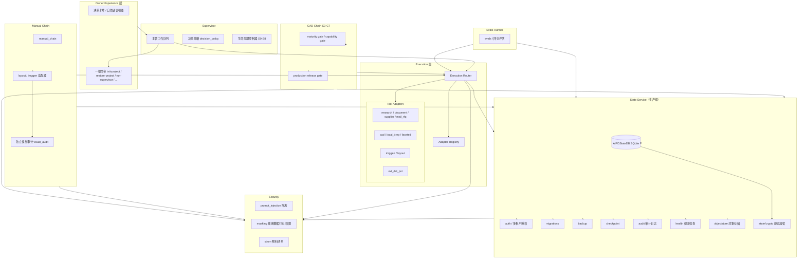

# AIPD-OS v5.6 架构

AIPD-OS（AI 产品工程决策操作系统）通过统一执行层与状态服务，编排从理论研究、
产品定义、连续附件产品手册、参数化 CAD、工业化、供应链到 EVT/DVT/PVT 与生产
发布的完整生命周期。

## 架构图

## 组件说明

### Execution Router / Tool Adapters
- **Execution Router**（`aipd_os/execution/execution_router.py`）：按能力标识选择
  适配器，进行能力可用性与输入校验，带退避的重试，按 `fallback_chain` 降级切换，
  持久化执行记录与证据。
- **Adapter Registry**（`execution/registry.py`）：注册/查询/发现工具适配器。
- **Tool Adapters**（`tool_adapters/`）：research、document、supplier、mail_rfq、
  cad、local_brep、faceted、imggen、layout、evt_dvt_pvt 等统一适配接口。

### Supervisor
- 主管工作队列、决策策略（`execution/decision_policy.py`）、S0–S8 生命周期控制。
- 仅在方向分叉、价值偏好、不可逆投入、安全法规、硬约束冲突时征询所有者决策。

### Manual Chain（imggen / layout / visual_audit）
- 连续附件产品手册：锚点、批次、独立高清页、PDF/ZIP、页面谱系与质量报告。
- `layout` 排版与 `imggen` 图像生成，`visual_audit` 提供独立视觉审计。
- 文件检查通过不等于视觉质量通过。

### State Service（auth / multi-tenant / migrations / backup / checkpoint / audit / health / objectstore）
- 多租户多项目状态存储；认证授权（`state/auth.py`）、静态加密
  （`state/crypto.py` + `SENSITIVE_KEYS`）、迁移（`state/migrations.py`）、
  备份（`state/backup.py`）、检查点恢复（`state/checkpoint.py`）、追加式审计
  （`state/audit.py`）、健康检查（`state/health.py`）、对象存储
  （`state/objects.py`）。
- 本地模式（纯 Python API）与 HTTP/JSON 传输（`state/server.py`）可插拔。

### Owner Experience 层
- 决策卡片与自然语言视图；一键命令（init-project、restore-project、run-supervisor、
  project-summary、submit-decision、run-manual-chain、run-cad-chain、run-tests、
  run-evals、build-release）。

### Evals Runner
- 评估与回归（`evals/`），用于验证生命周期门禁与质量基准的收敛。

### Security
- 提示注入隔离（`security/prompt_injection.py`）：外部内容始终作为数据。
- 敏感数据打码与权限（`security/masking.py`）。
- 确定性 SBOM（`security/sbom.py`）。
- 发布物签名（`scripts/sign_release.py`）。

## 数据流

1. Owner 通过对话/命令发出意图 → Supervisor 分解为工作队列。
2. Supervisor 经 Execution Router 调用工具适配器，产出证据与工件。
3. Manual Chain / CAD Chain 通过适配器执行，产物写入 State Service。
4. State Service 保障持久化、授权、加密、审计、备份与恢复。
5. Security 层对进入系统指令通道的外部内容做隔离，对敏感数据做打码与权限控制。
6. Evals Runner 对结果做回归评估，门禁通过后才允许生产声明。
